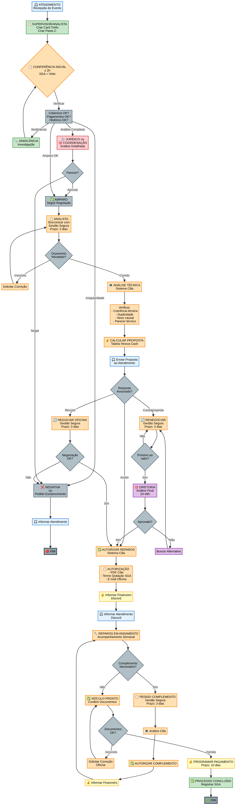

> Este documento foi gerado pela Manus AI, consolidando 5 POPs fornecidos em formato DOCX. As informações foram extraídas e reestruturadas para maior clareza e consistência.

# Procedimento Operacional Padrão (POP)
## Departamento de Evento e Sinistro

**Versão:** 2.0  
**Data de Emissão:** 08/10/2025  
**Responsável pela Revisão:** Coordenadora de Regulagem

---

## 1. Objetivo

Este documento estabelece o fluxo de trabalho, as responsabilidades e as rotinas do **Departamento de Evento e Sinistro** do Grupo MMB, garantindo a integridade dos processos, a eficiência da equipe e a conformidade com as diretrizes da empresa. O objetivo é padronizar as operações, desde a recepção de um evento até sua conclusão, assegurando um serviço de alta qualidade aos associados.

---

## 2. Organograma e Estrutura da Equipe

A equipe do departamento é estruturada para cobrir todas as fases do processo de sinistro, com papéis e responsabilidades bem definidos.

| Cargo | Nome | Principais Responsabilidades |
| :--- | :--- | :--- |
| **Coordenadora de Regulagem** | Fabiana | Supervisão geral, gestão de KPIs, auditorias, decisões estratégicas. |
| **Supervisora** | Amanda | Gestão de SMT, leilões, processos jurídicos e análise de benefícios. |
| **Supervisor** | Leonardo | Análise técnica, autorização de reparos, gestão de orçamentos. |
| **Analista de Regulagem** | Fernanda | Análise técnica, sincronização com Gestão Segura, pareceres. |
| **Analista Multifuncional** | Patricia | Rastreamento, assistência 24h, vistorias, processos de vidro. |

---

## 3. Fluxo Operacional Completo

O fluxo de trabalho é dividido em etapas claras, com prazos e responsáveis definidos. O diagrama abaixo ilustra o processo completo.

 <!-- Corrigido 2 -->

### Etapas Detalhadas:

1.  **Recepção do Evento (Atendimento):** O processo inicia com o registro do evento pelo time de atendimento no Discord e no sistema SGA.
2.  **Criação do Card (Supervisor/Analista):** Um card é criado no Trello e uma pasta no servidor Z: para organizar a documentação.
3.  **Conferência Inicial (≤ 2h):** O analista realiza uma conferência inicial no SGA, verificando cobertura, pagamentos e histórico.
4.  **Análise Técnica (Cilia):** A análise de danos e orçamentos é feita no sistema Cilia.
5.  **Parecer Técnico:** Um parecer é registrado no SGA com base na análise.
6.  **Decisão Estratégica:** Casos complexos são encaminhados para Sindicância, Análise Jurídica ou aprovação da Coordenação/Diretoria.
7.  **Autorização de Reparos:** Após a aprovação, a autorização é formalizada e comunicada à oficina e ao associado.
8.  **Pagamento e Encerramento:** O processo financeiro é iniciado e, após a conclusão, o processo é arquivado.

---

## 4. POPs por Função

### 4.1. Coordenadora (Fabiana)
- **Gestão de Equipe:** Gerenciar supervisores e analistas, realizar reuniões periódicas, avaliar desempenho e gerenciar conflitos.
- **Gestão de Processos:** Garantir cumprimento de prazos, validar processos antes do envio à diretoria, supervisionar emissão de termos via SGA.
- **Controle de Sistemas:** Garantir uso correto de SGA, Clicksign, Trello, Discord e planilhas.
- **Auditoria:** Realizar auditorias mensais e corrigir desvios.

### 4.2. Supervisora (Amanda)
- **SMT (Socorro Mútuo Total):** Validar documentação, controlar prazos de pagamento e apoiar a equipe em tratativas com despachantes e leilões.
- **Processos Jurídicos:** Atuar como ponto focal para o departamento jurídico, fornecendo documentação e pareceres.
- **Análise de Benefícios:** Realizar análises complexas de benefícios e negativas.

### 4.3. Supervisor (Leonardo)
- **Análise Técnica:** Supervisionar a análise de orçamentos, cotações e negociações.
- **Autorização de Reparos:** Validar e autorizar reparos dentro de sua alçada.
- **Gestão de Orçamentos:** Acompanhar o fluxo de orçamentos no Cilia e garantir a correta distribuição entre os analistas.

### 4.4. Analista de Regulagem (Fernanda)
- **Conferência Inicial:** Realizar a primeira análise do processo em até 2 horas.
- **Sincronização com Gestão Segura:** Enviar processos para orçamentação e acompanhar o retorno em até 3 dias.
- **Análise Técnica (Cilia):** Realizar a análise de danos, peças e orçamentos no sistema Cilia.
- **Parecer Técnico:** Registrar pareceres detalhados no SGA.

### 4.5. Analista Multifuncional (Patricia)
- **Rastreamento:** Gerenciar processos de rastreamento com os parceiros (Pooltrack, CGE Mossoró, etc.), com prazos de 24h (Goiânia) e 72h (fora).
- **Assistência 24h:** Acionar o parceiro Infinity System e acompanhar o atendimento.
- **Vistoria:** Acompanhar o processo de vistoria (prazo de 15 minutos) via sistema Visto.
- **Processos de Vidro:** Gerenciar os processos de reparo e troca de vidros.

---

## 5. Sistemas e Ferramentas

O departamento utiliza um conjunto de 8 ferramentas integradas para garantir a eficiência do processo.

- **SGA (Hinova):** Sistema central de gestão.
- **Cilia:** Plataforma de regulação e orçamentos.
- **Gestão Segura:** Sincronização e orçamentação externa.
- **Visto:** Sistema para registro fotográfico de vistorias.
- **Trello:** Gestão de tarefas e fluxo de trabalho.
- **Discord:** Comunicação interna entre equipes.
- **Clicksign:** Plataforma para assinaturas digitais.
- **Planilhas Google (Z:):** Repositório de documentos e planilhas de controle.

---

## 6. Indicadores de Desempenho (KPIs)

| KPI | Meta | Descrição |
| :--- | :--- | :--- |
| **TMAI** | ≤ 2.0h | Tempo Médio de Análise Inicial pelo analista. |
| **TMAR** | ≤ 72h | Tempo Médio até a Autorização final do reparo. |
| **Retorno Gestão Segura** | ≤ 3 dias | Prazo para a Gestão Segura retornar com o orçamento. |
| **Taxa de Retrabalho** | ≤ 5.0% | Percentual de processos que retornam para correção. |
| **Conformidade Documental** | 100% | Todos os documentos necessários devem estar corretos. |
| **Pagamento Oficinas** | ≤ 10 dias | Prazo para pagamento das oficinas após a conclusão. |

---

## 7. Checklist de Auditoria Mensal

(Veja o documento `Checklist_Auditoria_Sinistro.pdf` para o formulário completo)

- **Gestão de Processos (6 itens):** Prazos, registros, etc.
- **Gestão de Documentos (2 itens):** Arquivamento, assinaturas.
- **Comunicação (2 itens):** Uso correto dos canais.
- **Jurídico (2 itens):** Encaminhamento e pareceres.
- **Financeiro (2 itens):** Lançamentos e pagamentos.
- **SMT (2 itens):** Documentação e prazos.
- **Rastreamento (2 itens):** Acionamento e acompanhamento.
- **Assistência 24h (2 itens):** Registro e solução.
- **Vistoria (2 itens):** Qualidade das fotos e prazos.
- **Auditoria (2 itens):** Conformidade geral.

---

## 8. Revisão e Atualização

Este POP deve ser revisado **semestralmente** ou sempre que houver uma alteração significativa nas atividades do departamento. A responsabilidade pela revisão é da Coordenadora de Regulagem em conjunto com a Diretoria.

